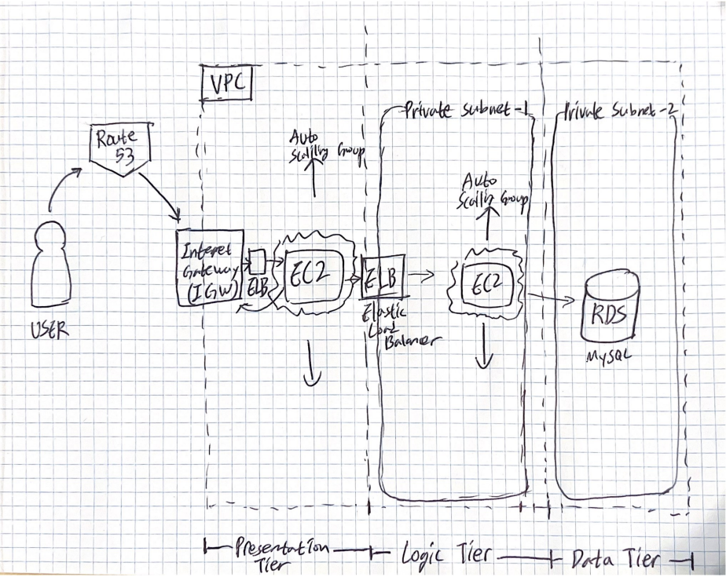

## What I want to learn from this project
- Software Architecture
- How to use cloud computing service (AWS) when building a software

## Software Architecture

### 3-tier or n-tier architecture?

### Why 3-tier?
To experience:
- A variety of AWS services
- Front-end
- Back-end
- Relational database

### Overview
My draft architecture
  

Presentation Tier (WebServer):
> Route 53, Internet Gateway                 

Logic Tier (AppServer):
> EC2, Auto Scailing Group

Data Tier:
> RDS

Presentation Tier <-> Logic Tier:
> Elastic Load Balancer 

Logic Tier <-> Data Tier:
> 

### Technologies
WebServer
> Option 1: Static website using AWS S3     
> Option 2: Dynamic website  

AppServer
> Java: I just want to experience Java more

Database
> MySQL: AWS Aurora supports either MySQL -or- PostgreSQL, and I want to experience more *traditional* database

## Note
- Be aware of AWS usage. If I'm not cautious enough, AWS bill will be a nightmare
- Don't forget to document **everything** such as my reasoning for certain decision, progress, error, etc.
